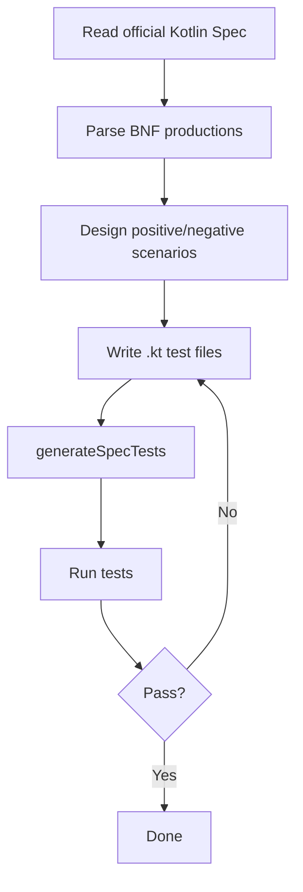

# Kotlin Spec Test Suite Guide

This document describes how to build, run, and extend tests in the `compiler/tests-spec` module.

**Languages**: [English](spec-test-suite-guide.md) · [简体中文](spec-test-suite-guide_zh.md)

---

## Table of contents

- [1. Build, package, and run tests](#1-build-package-and-run-tests)
- [2. Adding new test cases](#2-adding-new-test-cases)
- [3. Reading the HTML report](#3-reading-the-html-report)
- [4. Framework maintenance and extension](#4-framework-maintenance-and-extension)

---

## 1. Build, package, and run tests

### 1.1 Module layout

```
compiler/tests-spec/
├── build.gradle.kts           # Module build configuration
├── testData/                  # Automated test sources
│   ├── codegen/box/           # Code generation tests
│   │   ├── linked/            # Spec-linked tests
│   │   │   ├── [chapter]/[section]/[sub-section]/
│   │   │   │   ├── p-[N]/     # Paragraph directory
│   │   │   │   │   ├── pos/   # Positive cases
│   │   │   │   │   └── neg/   # Negative cases
│   │   │   │   └── testsMap.json    # Auto-generated test index
│   │   │   └── sectionsMap.json     # Auto-generated section index
│   │   ├── notLinked/         # Flexibility tests (not spec-linked)
│   │   ├── helpers/           # Helper code
│   │   └── templates/         # Test templates
│   ├── diagnostics/           # Diagnostic tests (same layout)
│   └── psi/                   # Lexical/syntax parsing tests (same layout)
├── tests/                     # Test framework and generated test classes
│   └── org/jetbrains/kotlin/spec/
│       ├── codegen/           # Codegen test base classes and generated classes
│       ├── checkers/          # Diagnostic test base classes and generated classes
│       ├── parsing/           # Parsing test base classes and generated classes
│       └── utils/             # Utilities (parsers, generators, validators, …)
└── docs/                      # Documentation
    └── spec-test-suite-guide.md   # This document
```

### 1.2 Environment

| Item | Requirement |
|------|-------------|
| Hardware | Mac (ARM) or equivalent dev machine |
| IDE | IntelliJ IDEA |
| Source | Clone and sync the Kotlin repository |
| JDK | Match the project Gradle configuration |

### 1.3 Build and index generation

After adding, changing, or updating test files, **regenerate the test index first**.

```bash
./gradlew :compiler:tests-spec:generateSpecTests
```

This task:

1. **Parses test file headers**: scans linked tests under `testData/` for `MAIN LINK`, `DESCRIPTION`, `SPEC VERSION`, and related metadata
2. **Generates `testsMap.json`**: per-chapter index mapping paragraphs, sentences, and test files
3. **Generates `sectionsMap.json`**: chapter structure index at the `linked/` root
4. **Generates JUnit test classes**: e.g. `BlackBoxCodegenTestSpecGenerated`, `DiagnosticsTestSpecGenerated`, `FirBlackBoxCodegenTestSpecGenerated`

### 1.4 Package

```bash
./gradlew :compiler:tests-spec:testJar
```

Output: `compiler/tests-spec/build/libs/tests-spec-<version>-tests.jar`. This task packages the module's compiled test classes into a jar with the `tests` classifier and exposes it via the `tests-jar` configuration, so other modules can depend on it with `projectTests(":compiler:tests-spec")`. Running spec tests in IDEA does not use this jar: after Gradle Sync, run the Generated test classes directly.

### 1.5 Run tests

#### 1.5.1 Full spec test run

```bash
./gradlew :compiler:tests-spec:test 
```

**Common options**:

| Flag / property | Purpose | Example | When to use |
| :--- | :--- | :--- | :--- |
| `--tests` | Run one or more tests (supports `*`) | `./gradlew :compiler:tests-spec:test --tests "*p-6*"` | Debug a paragraph without a full run |
| `--tests *...` | Multiple test patterns | `./gradlew :compiler:tests-spec:test --tests "*p-1*" --tests "*p-10*"` | Verify distant chapters together |
| `--rerun-tasks` | Ignore UP-TO-DATE | `./gradlew :compiler:tests-spec:test --rerun-tasks` | Force re-run after framework/dependency changes |
| `--no-build-cache` | Disable build cache | `./gradlew :compiler:tests-spec:test --no-build-cache` | Clean CI builds |
| `--no-configuration-cache` | Disable configuration cache | `./gradlew :compiler:tests-spec:test --no-configuration-cache` | Debug Gradle configuration |
| `--parallel` | Parallel Gradle tasks | `./gradlew :compiler:tests-spec:test --parallel` | Speed up on multi-core machines |
| `--max-workers` | Limit parallel workers | `./gradlew :compiler:tests-spec:test --parallel --max-workers=4` | Resource-constrained environments |
| `-Pkotlin.test.junit5.maxParallelForks=<n>` | JUnit 5 forks inside a task | `./gradlew :compiler:tests-spec:test -Pkotlin.test.junit5.maxParallelForks=2` | Lower parallelism for stability |

#### 1.5.2 Targeted example: when-expression paragraph 4

```bash
./gradlew :compiler:tests-spec:test \
  --tests '*BlackBoxCodegenTestSpecGenerated*$when_expression*$P_4*' \
  --tests '*FirBlackBoxCodegenTestSpecGenerated*$when_expression*$P_4*' \
  --tests '*DiagnosticsTestSpecGenerated*$when_expression*$P_4*'
```

**Wildcard reference**:

| Fragment | Meaning |
|----------|---------|
| `*BlackBoxCodegenTestSpecGenerated*` | K1 codegen test class |
| `*FirBlackBoxCodegenTestSpecGenerated*` | FIR codegen test class |
| `*DiagnosticsTestSpecGenerated*` | Diagnostic test class |
| `$when_expression$` | Spec sub-section (path with underscores) |
| `$P_4$` | Paragraph number (`p-4` directory → `P_4`) |

#### 1.5.3 Run by test class

```bash
./gradlew :compiler:tests-spec:test --tests "org.jetbrains.kotlin.spec.codegen.BlackBoxCodegenTestSpecGenerated"
./gradlew :compiler:tests-spec:test --tests "org.jetbrains.kotlin.test.runners.FirBlackBoxCodegenTestSpecGenerated"
./gradlew :compiler:tests-spec:test --tests "org.jetbrains.kotlin.spec.checkers.DiagnosticsTestSpecGenerated"
./gradlew :compiler:tests-spec:test --tests "org.jetbrains.kotlin.spec.parsing.ParsingTestSpecGenerated"
```

#### 1.5.4 Other useful commands

```bash
# Update diagnostic golden files (after confirming expected changes)
./gradlew :compiler:tests-spec:test -Pkotlin.spec.update.diagnostics=true
```

### 1.6 Pass criteria

| Test type | Directory | Pass condition |
|-----------|-----------|----------------|
| Codegen positive | `codegen/box/linked/.../pos/` | Compiles and `box()` returns `"OK"` |
| Codegen negative | `codegen/box/linked/.../neg/` | Compile fails with expected `compiletime` exception |
| Diagnostics positive | `diagnostics/linked/.../pos/` | Compiles with no diagnostic errors |
| Diagnostics negative | `diagnostics/linked/.../neg/` | Correct error at `<!ERROR_TYPE!>` markers |

Negative codegen tests with `EXCEPTION: compiletime` require a matching `{name}.exceptions.compiletime.txt` file. Diagnostic tests use inline markers (`<!ERROR!>`), not `.exceptions.compiletime.txt` files.

### 1.7 Report location

```
compiler/tests-spec/build/reports/tests/test/index.html
```

---

## 2. Adding new test cases

### 2.1 Workflow overview



### 2.2 Step-by-step

#### Step 1: Read the official Kotlin Spec

From the [Kotlin language specification](https://kotlinlang.org/spec/), focus on:
- BNF productions
- Normative text
- Boundary conditions

#### Step 2: Parse BNF productions

Identify:
- Parts of each grammar rule
- Composable elements
- Constraints and restrictions

#### Step 3: Design test scenarios

| Scenario | Description | Example |
|----------|-------------|---------|
| Positive | Valid code compiles/runs | Code matching the grammar |
| Negative | Invalid code is rejected | Code missing required elements |
| Boundary | Edge cases | Empty values, extremes, nesting |

#### Step 4: Write `.kt` test files

**Path pattern**:

```
testData/[TestArea]/linked/[chapter]/[section]/[sub-section]/p-[N]/[pos|neg]/[N.M].kt
```

**Example**:

```
testData/codegen/box/linked/expressions/when-expression/p-4/pos/1.1.kt
```

**Header format**:

```kotlin
// WITH_STDLIB
// FULL_JDK

/*
 * KOTLIN CODEGEN BOX SPEC TEST (POSITIVE)
 *
 * SPEC VERSION: 0.1-313
 * MAIN LINK: expressions, when-expression -> paragraph 4 -> sentence 1
 * NUMBER: 1
 * DESCRIPTION: it is possible to replace the else condition with an always-true condition (Enum)
 */
```

**Header fields**:

| Field | Required | Description |
|-------|----------|-------------|
| `SPEC VERSION` | Yes | Spec version |
| `MAIN LINK` | Yes | Spec location: `section1, section2, ... -> paragraph N -> sentence M` |
| `NUMBER` | Yes | Case number (unique within the paragraph) |
| `DESCRIPTION` | Yes | What the test verifies |

**Positive example**:

```kotlin
// WITH_STDLIB
// FULL_JDK

/*
 * KOTLIN CODEGEN BOX SPEC TEST (POSITIVE)
 *
 * SPEC VERSION: 0.1-313
 * MAIN LINK: expressions, when-expression -> paragraph 4 -> sentence 1
 * NUMBER: 1
 * DESCRIPTION: it is possible to replace the else condition with an always-true condition (Enum)
 */

// FILE: JavaEnum.java
enum JavaEnum {
    Val_1,
    Val_2,
    Val_3,
}

// FILE: KotlinClass.kt
fun box(): String {
    val z = JavaEnum.Val_3
    val when3 = when (z) {
        JavaEnum.Val_1 -> { "NOK" }
        JavaEnum.Val_3 -> { "OK" }
        JavaEnum.Val_3 -> { "NOK" }
        JavaEnum.Val_2 -> { "NOK" }
    }
    return when3
}
```

#### Step 5: Regenerate index

```bash
./gradlew :compiler:tests-spec:generateSpecTests
```

This updates:
- `testsMap.json`
- `sectionsMap.json`
- `*TestSpecGenerated.java` JUnit classes

#### Step 6: Verify

```bash
./gradlew :compiler:tests-spec:test --tests '*$when_expression*$P_4*'
```

### 2.3 Checklist

- [ ] Path matches `testData/[TestArea]/linked/[chapter]/[section]/[sub-section]/p-[N]/[pos|neg]/[N.M].kt`
- [ ] Header includes `MAIN LINK`, `SPEC VERSION`, `NUMBER`, `DESCRIPTION`
- [ ] Paragraph/sentence numbers in `MAIN LINK` match the directory layout
- [ ] Positive: `box()` returns `"OK"`; negative: expected error markers or `.exceptions.compiletime.txt`
- [ ] `generateSpecTests` succeeded and `testsMap.json` is updated
- [ ] Tests pass

---

## 3. Reading the HTML report

Report path: `compiler/tests-spec/build/reports/tests/test/index.html`

### 3.1 Pass rate

| Metric | Formula |
|--------|---------|
| Pass rate | `Passed / (Passed + Failed) × 100%` |

Expand each `*TestSpecGenerated` class to see subtree results.

### 3.2 Locating failures

1. Open a failed test and note the method name (e.g. `testExpressions_When_Expression_P_4_Pos_1_1`)
2. Map the method name back to a `.kt` file under `testData/`
3. Read `MAIN LINK` in the file header for spec chapter / paragraph / sentence
4. Cross-check `testsMap.json` by paragraph for related cases

---

## 4. Framework maintenance and extension

### 4.1 Core components

| Component | Role | Location |
|-----------|------|----------|
| `CommonParser` | Parse `.kt` file headers | `utils/parsers/CommonParser.kt` |
| `TestsJsonMapGenerator` | Generate `testsMap.json` | `utils/TestsJsonMapGenerator.kt` |
| `SectionsJsonMapGenerator` | Generate `sectionsMap.json` | `utils/SectionsJsonMapGenerator.kt` |
| `GenerateSpecTests` | Generate JUnit `*Generated` classes | `utils/tasks/GenerateSpecTests.kt` |

### 4.2 Test classification

| Enum | Values |
|------|--------|
| `TestArea` | `PSI` / `DIAGNOSTICS` / `CODEGEN_BOX` |
| `TestType` | `pos` / `neg` |
| `SpecTestLinkedType` | `linked` / `notLinked` |

### 4.3 Extending `TestArea`

1. Add an entry to the `TestArea` enum
2. Create an `Abstract*TestSpec` base class
3. Register the test class and data path in `GenerateSpecTests.kt`
4. Run `generateSpecTests` to verify

---

## Appendix

### A. Gradle task cheat sheet

| Task | Command |
|------|---------|
| Generate test index | `./gradlew :compiler:tests-spec:generateSpecTests` |
| Run tests | `./gradlew :compiler:tests-spec:test` |
| Package | `./gradlew :compiler:tests-spec:testJar` |
| Update diagnostic goldens | `./gradlew :compiler:tests-spec:test -Pkotlin.spec.update.diagnostics=true` |

### B. Test class mapping

| TestArea | Generated classes |
|----------|-------------------|
| psi | `ParsingTestSpecGenerated` |
| codegen/box | `BlackBoxCodegenTestSpecGenerated` / `FirBlackBoxCodegenTestSpecGenerated` |
| diagnostics | `DiagnosticsTestSpecGenerated` / `FirLightTreeDiagnosticTestSpecGenerated` / `FirPsiDiagnosticTestSpecGenerated` |

### C. Reference files

| File | Description |
|------|-------------|
| `testData/**/testsMap.json` | Auto-generated index (.kt → spec paragraph) |
| `testData/**/sectionsMap.json` | Auto-generated section structure |
| `tests/org/jetbrains/kotlin/spec/utils/tasks/GenerateSpecTests.kt` | Index generation task |
| `tests/org/jetbrains/kotlin/spec/utils/parsers/CommonParser.kt` | Test header parser |
