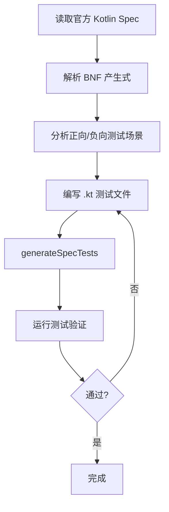

# Kotlin Spec 测试套使用指南

本文档说明 `compiler/tests-spec` 模块的构建、执行、用例新增。

**语言**：[English](spec-test-suite-guide.md) · [简体中文](spec-test-suite-guide_zh.md)

---

## 目录
- [1. 测试套构建、打包与执行](#1-测试套构建打包与执行)
- [2. 新增用例流程](#2-新增用例流程)
- [3. 可视化报告解读](#3-可视化报告解读)
- [4. 测试框架维护与扩展](#4-测试框架维护与扩展)

---

## 1. 测试套构建、打包与执行

### 1.1 模块结构

```
compiler/tests-spec/
├── build.gradle.kts           # 模块构建配置
├── testData/                  # 自动化测试源码
│   ├── codegen/box/           # 代码生成测试
│   │   ├── linked/            # 绑定规范的测试
│   │   │   ├── [chapter]/[section]/[sub-section]/
│   │   │   │   ├── p-[N]/     # 段落目录
│   │   │   │   │   ├── pos/   # 正向用例
│   │   │   │   │   └── neg/   # 负向用例
│   │   │   │   └── testsMap.json    # 自动生成的测试索引
│   │   │   └── sectionsMap.json     # 自动生成的章节结构索引
│   │   ├── notLinked/         # 灵活性测试（不绑定规范）
│   │   ├── helpers/           # 辅助代码
│   │   └── templates/         # 测试模板
│   ├── diagnostics/           # 诊断测试（同上结构）
│   └── psi/                   # 词法/语法解析测试（同上结构）
├── tests/                     # 测试框架与 Generated 测试类
│   └── org/jetbrains/kotlin/spec/
│       ├── codegen/           # 代码生成测试基类与生成类
│       ├── checkers/          # 诊断测试基类与生成类
│       ├── parsing/           # 解析测试基类与生成类
│       └── utils/             # 工具类（解析器、生成器、验证器等）
└── docs/                      # 文档目录
    └── spec-test-suite-guide_zh.md   # 本文档
```

### 1.2 环境准备

| 项目 | 要求 |
|------|------|
| 硬件 | Mac (ARM) 或同等开发机 |
| IDE | IntelliJ IDEA |
| 源码 | 克隆并同步 Kotlin 工程 |
| JDK | 与项目 Gradle 配置一致 |

### 1.3 构建与索引生成

新增或修改、或每次更新测试套的测试文件后，**必须先重新生成测试索引**。

```bash
./gradlew :compiler:tests-spec:generateSpecTests
```

该任务会执行以下步骤：

1. **解析测试文件头**：扫描 `testData/` 下的 linked 测试文件，解析 `MAIN LINK`、`DESCRIPTION`、`SPEC VERSION` 等元数据
2. **生成 `testsMap.json`**：在每个章节目录下生成测试索引文件，记录段落、句子与测试文件的映射关系
3. **生成 `sectionsMap.json`**：在 `linked/` 根目录生成章节结构索引
4. **生成 JUnit 测试类**：生成 `BlackBoxCodegenTestSpecGenerated`、`DiagnosticsTestSpecGenerated`、`FirBlackBoxCodegenTestSpecGenerated` 等

### 1.4 打包

```bash
./gradlew :compiler:tests-spec:testJar
```

产出：`compiler/tests-spec/build/libs/tests-spec-<version>-tests.jar`。该任务把本模块的 test 编译产物打成带 `tests` classifier 的 jar，并通过 `tests-jar` 配置对外暴露，供其他模块以 `projectTests(":compiler:tests-spec")` 依赖。日常在 IDEA 里跑 spec 测试不依赖这个 jar：Gradle Sync 后直接运行 Generated 测试类即可。

### 1.5 执行测试

#### 1.5.1 运行全量 spec 测试

```bash
./gradlew :compiler:tests-spec:test 
```

**常用参数**：

| 参数/标志 | 作用 | 使用示例 | 适用场景 |
| :--- | :--- | :--- | :--- |
| `--tests` | 指定单个或多个测试（支持 `*`） | `./gradlew :compiler:tests-spec:test --tests "*p-6*"` | 调试特定段落，避免全量运行 |
| `--tests *...` | 同时运行多个测试模式 | `./gradlew :compiler:tests-spec:test --tests "*p-1*" --tests "*p-10*"` | 验证相距较远的多个章节 |
| `--rerun-tasks` | 忽略 UP-TO-DATE，强制重跑 | `./gradlew :compiler:tests-spec:test --rerun-tasks` | 修改框架或依赖后确保真实重跑 |
| `--no-build-cache` | 禁用构建缓存 | `./gradlew :compiler:tests-spec:test --no-build-cache` | CI 环境保证干净构建 |
| `--no-configuration-cache` | 禁用配置缓存 | `./gradlew :compiler:tests-spec:test --no-configuration-cache` | 调试构建配置问题 |
| `--parallel` | 并行执行 Gradle 任务 | `./gradlew :compiler:tests-spec:test --parallel` | 多核机器加速 |
| `--max-workers` | 限制并行线程数 | `./gradlew :compiler:tests-spec:test --parallel --max-workers=4` | 资源受限环境 |
| `-Pkotlin.test.junit5.maxParallelForks=<n>` | 控制 JUnit 5 单任务内并行度 | `./gradlew :compiler:tests-spec:test -Pkotlin.test.junit5.maxParallelForks=2` | 调试或降低并行以保稳定 |

#### 1.5.2 单点测试套示例

**when-expression 段落 4 测试**：

```bash
./gradlew :compiler:tests-spec:test \
  --tests '*BlackBoxCodegenTestSpecGenerated*$when_expression*$P_4*' \
  --tests '*FirBlackBoxCodegenTestSpecGenerated*$when_expression*$P_4*' \
  --tests '*DiagnosticsTestSpecGenerated*$when_expression*$P_4*'
```

**通配符说明**：

| 片段 | 含义 |
|------|------|
| `*BlackBoxCodegenTestSpecGenerated*` | K1 代码生成测试类 |
| `*FirBlackBoxCodegenTestSpecGenerated*` | FIR 代码生成测试类 |
| `*DiagnosticsTestSpecGenerated*` | 诊断测试类 |
| `$when_expression$` | 规范子章节（路径转下划线） |
| `$P_4$` | 段落编号（目录 `p-4` 对应 `P_4`） |

#### 1.5.3 按测试类运行

```bash
./gradlew :compiler:tests-spec:test --tests "org.jetbrains.kotlin.spec.codegen.BlackBoxCodegenTestSpecGenerated"
./gradlew :compiler:tests-spec:test --tests "org.jetbrains.kotlin.test.runners.FirBlackBoxCodegenTestSpecGenerated"
./gradlew :compiler:tests-spec:test --tests "org.jetbrains.kotlin.spec.checkers.DiagnosticsTestSpecGenerated"
./gradlew :compiler:tests-spec:test --tests "org.jetbrains.kotlin.spec.parsing.ParsingTestSpecGenerated"
```

#### 1.5.4 其他常用命令

```bash
# 更新诊断 golden 文件（确认预期变更后使用）
./gradlew :compiler:tests-spec:test -Pkotlin.spec.update.diagnostics=true
```

### 1.6 测试通过标准

| 测试类型 | 目录 | 通过条件 |
|----------|------|----------|
| Codegen 正向 | `codegen/box/linked/.../pos/` | 编译通过且 `box()` 返回 `"OK"` |
| Codegen 负向 | `codegen/box/linked/.../neg/` | 编译失败，抛出预期 `compiletime` 异常 |
| Diagnostics 正向 | `diagnostics/linked/.../pos/` | 编译通过，无诊断错误 |
| Diagnostics 负向 | `diagnostics/linked/.../neg/` | `<!ERROR_TYPE!>` 标记处正确报错 |

Codegen 负向测试中，`EXCEPTION: compiletime` 需配套 `{名称}.exceptions.compiletime.txt` 文件。Diagnostics 测试使用内联诊断标记（`<!ERROR!>`），不使用 `.exceptions.compiletime.txt`。

### 1.7 报告位置

```
compiler/tests-spec/build/reports/tests/test/index.html
```

---

## 2. 新增用例流程

### 2.1 流程总览



### 2.2 步骤详解

#### 步骤 1：读取官方 Kotlin Spec

从 [Kotlin 官方规范](https://kotlinlang.org/spec/) 获取目标章节内容，重点关注：
- BNF 产生式定义
- 规范文本描述
- 边界条件说明

#### 步骤 2：解析 BNF 产生式

分析产生式结构，识别：
- 语法规则的组成部分
- 可组合的元素
- 约束条件和限制

#### 步骤 3：分析测试场景

根据规范分析，设计测试场景：

| 场景类型 | 说明 | 示例 |
|----------|------|------|
| 正向用例 | 验证符合规范的代码能正确编译/运行 | 符合语法规则的有效代码 |
| 负向用例 | 验证不符合规范的代码会被正确拒绝 | 缺少必要元素的代码 |
| 边界条件 | 验证规范的边界情况 | 空值、极端值、嵌套结构 |

#### 步骤 4：编写 .kt 测试文件

**路径模式**：

```
testData/[TestArea]/linked/[chapter]/[section]/[sub-section]/p-[N]/[pos|neg]/[N.M].kt
```

**示例**：

```
testData/codegen/box/linked/expressions/when-expression/p-4/pos/1.1.kt
```

**文件头格式**：

```kotlin
// WITH_STDLIB
// FULL_JDK

/*
 * KOTLIN CODEGEN BOX SPEC TEST (POSITIVE)
 *
 * SPEC VERSION: 0.1-313
 * MAIN LINK: expressions, when-expression -> paragraph 4 -> sentence 1
 * NUMBER: 1
 * DESCRIPTION: it is possible to replace the else condition with an always-true condition (Enum)
 */
```

**文件头字段说明**：

| 字段 | 必填 | 说明 |
|------|------|------|
| `SPEC VERSION` | 是 | 规范版本号 |
| `MAIN LINK` | 是 | 规范定位：`section1, section2, ... -> paragraph N -> sentence M` |
| `NUMBER` | 是 | 用例编号（同段落内唯一） |
| `DESCRIPTION` | 是 | 测试点描述 |

**正向用例示例**：

```kotlin
// WITH_STDLIB
// FULL_JDK

/*
 * KOTLIN CODEGEN BOX SPEC TEST (POSITIVE)
 *
 * SPEC VERSION: 0.1-313
 * MAIN LINK: expressions, when-expression -> paragraph 4 -> sentence 1
 * NUMBER: 1
 * DESCRIPTION: it is possible to replace the else condition with an always-true condition (Enum)
 */

// FILE: JavaEnum.java
enum JavaEnum {
    Val_1,
    Val_2,
    Val_3,
}

// FILE: KotlinClass.kt
fun box(): String {
    val z = JavaEnum.Val_3
    val when3 = when (z) {
        JavaEnum.Val_1 -> { "NOK" }
        JavaEnum.Val_3 -> { "OK" }
        JavaEnum.Val_3 -> { "NOK" }
        JavaEnum.Val_2 -> { "NOK" }
    }
    return when3
}
```

#### 步骤 5：生成索引

```bash
./gradlew :compiler:tests-spec:generateSpecTests
```

该命令会自动生成：
- `testsMap.json`：测试文件与规范段落的映射
- `sectionsMap.json`：章节结构索引
- `*TestSpecGenerated.java`：JUnit 测试类

#### 步骤 6：验证测试

运行测试验证用例正确性：

```bash
./gradlew :compiler:tests-spec:test --tests '*$when_expression*$P_4*'
```

### 2.3 检查清单

- [ ] 文件路径符合 `testData/[TestArea]/linked/[chapter]/[section]/[sub-section]/p-[N]/[pos|neg]/[N.M].kt` 格式
- [ ] 文件头包含完整的 `MAIN LINK`、`SPEC VERSION`、`NUMBER`、`DESCRIPTION`
- [ ] `MAIN LINK` 中的段落/句子编号与目录结构一致
- [ ] 正向用例 `box()` 返回 `"OK"`，负向用例包含预期错误标记或 `.exceptions.compiletime.txt`
- [ ] `generateSpecTests` 执行成功，`testsMap.json` 已更新
- [ ] 测试运行通过

---

## 3. 可视化报告解读

报告路径：`compiler/tests-spec/build/reports/tests/test/index.html`

### 3.1 用例通过率

| 指标 | 计算方式 |
|------|----------|
| 通过率 | `Passed / (Passed + Failed) × 100%` |

按测试类展开，可查看各 `*TestSpecGenerated` 子树的通过情况。

### 3.2 失败用例定位

1. 点击失败项，查看测试方法名（如 `testExpressions_When_Expression_P_4_Pos_1_1`）
2. 将方法名还原为 `testData/` 下的 `.kt` 路径
3. 读文件头 `MAIN LINK` → 得到 Spec 章节 / 段落 / 句子
4. 在 `testsMap.json` 中按段落编号匹配，确认其他相关用例

---

## 4. 测试框架维护与扩展

### 4.1 核心组件

| 组件 | 职责 | 位置 |
|------|------|------|
| `CommonParser` | 解析 .kt 文件头元数据 | `utils/parsers/CommonParser.kt` |
| `TestsJsonMapGenerator` | 生成 `testsMap.json` | `utils/TestsJsonMapGenerator.kt` |
| `SectionsJsonMapGenerator` | 生成 `sectionsMap.json` | `utils/SectionsJsonMapGenerator.kt` |
| `GenerateSpecTests` | 生成 JUnit `*Generated` 测试类 | `utils/tasks/GenerateSpecTests.kt` |

### 4.2 测试分类

| 枚举 | 含义 |
|------|------|
| `TestArea` | `PSI` / `DIAGNOSTICS` / `CODEGEN_BOX` |
| `TestType` | `pos`（正向）/ `neg`（负向） |
| `SpecTestLinkedType` | `linked`（绑定规范）/ `notLinked`（灵活性测试） |

### 4.3 扩展 TestArea

1. 在 `TestArea` 枚举新增条目
2. 创建 `Abstract*TestSpec` 基类
3. 在 `GenerateSpecTests.kt` 注册测试类与数据路径
4. 运行 `generateSpecTests` 验证

---

## 附录

### A. Gradle 任务速查

| 任务 | 命令 |
|------|------|
| 生成测试索引 | `./gradlew :compiler:tests-spec:generateSpecTests` |
| 运行测试 | `./gradlew :compiler:tests-spec:test` |
| 打包 | `./gradlew :compiler:tests-spec:testJar` |
| 更新诊断 golden | `./gradlew :compiler:tests-spec:test -Pkotlin.spec.update.diagnostics=true` |

### B. 测试类映射

| TestArea | 生成测试类 |
|----------|-----------|
| psi | `ParsingTestSpecGenerated` |
| codegen/box | `BlackBoxCodegenTestSpecGenerated` / `FirBlackBoxCodegenTestSpecGenerated` |
| diagnostics | `DiagnosticsTestSpecGenerated` / `FirLightTreeDiagnosticTestSpecGenerated` / `FirPsiDiagnosticTestSpecGenerated` |

### C. 参考文件

| 文件 | 说明 |
|------|------|
| `testData/**/testsMap.json` | 自动生成的测试索引（.kt → 规范段落） |
| `testData/**/sectionsMap.json` | 自动生成的章节结构索引 |
| `tests/org/jetbrains/kotlin/spec/utils/tasks/GenerateSpecTests.kt` | 测试索引生成任务 |
| `tests/org/jetbrains/kotlin/spec/utils/parsers/CommonParser.kt` | 测试文件头解析器 |
