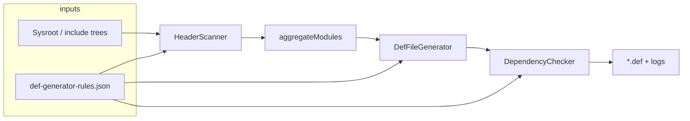

# OHOS `.def` file generator

Generates Kotlin/Native **platform library** `.def` files for OpenHarmony (OHOS) and HMS headers by scanning SDK sysroots, grouping headers into modules, inferring `depends` from `#include`, and applying rule-based overrides.

## Prerequisites

- **JDK** (for running the app or fat JAR)
- **Gradle** or the repository root `gradlew` (recommended)
- **SDK layout** (one or both):
  - **Konan sysroot**: directory whose name contains `sysroot-ohos` or `sysroot-hms`, with headers under `usr/include`
  - **Flat layout**: root containing `ohos_include` and/or `hms_include`

## Quick start

### Wrapper script (typical in-tree workflow)

From this directory:

```bash
./build_ohos_def.sh
```

This script:

1. Resolves OHOS/HMS sysroots via `KONAN_DATA_DIR`, `KONAN_SYSROOT_OHOS`, and `KONAN_SYSROOT_HMS` (see script defaults and optional `def-generator.config`).
2. Clears the output directory (`output/` by default, overridable with `DEFAULT_OUTPUT_REL`).
3. Runs `gradle run` or repo `gradlew` with `--source` for both sysroots and `--output`.

Optional `def-generator.config` (sourced by the script) can set environment variables such as `KONAN_SYSROOT_OHOS`.

### Gradle

```bash
# From kotlin-native/tools/ohos-def-generator
./gradlew run --args='--source /path/to/sysroot-ohos --source /path/to/sysroot-hms --output ./output'
```

Or with repo root Gradle:

```bash
../../../gradlew -p kotlin-native/tools/ohos-def-generator run --args='--source ... --output ...'
```

### Fat JAR

```bash
../../../gradlew -p kotlin-native/tools/ohos-def-generator jar
java -jar build/libs/ohos-def-generator-*.jar --source ... --output ...
```

## CLI reference

| Option | Description |
|--------|-------------|
| `--source <path>` | SDK root (repeatable). Required unless default `sysroot` paths exist relative to CWD. |
| `--output <path>` | Directory for generated `*.def` files. |
| `--config <path>` | Explicit `def-generator-rules.json` path. |
| `--sdk ohos \| hms \| all` | Which SDK slices to scan (default: `all`). |
| `--language <name>` | Written into `.def` (default: `C++`). |
| `--compiler-opts <opts>` | Written into `.def` (default: `-std=c++17`). |
| `-h`, `--help` | Usage. |

**Rules file resolution** (when `--config` is omitted):

1. If the first `--source` path has a parent directory containing `def-generator-rules.json`, that file is used.
2. Otherwise the bundled resource `src/main/resources/def-generator-rules.json` is used.

**Exit code**: `0` if generation and validation pass; non-zero on errors or validation failures (see logs under `<output>/logs/`).

## Valid headers and module model

A header is **included** only if it contains Doxygen-style tags the scanner understands:

- `@addtogroup <ModuleName>` — module identity (unless overridden by rules)
- `@kit <KitName>` — used for `package = platform.<Kit>.<Module>` when no `packageOverride` applies
- `@library libfoo.so` — contributes `-l` flags in `linkerOpts`

`#include` lines are parsed; non-system includes are resolved to other scanned headers to build **inter-module `depends`**.

## Rules file (`def-generator-rules.json`)

Central place for SDK quirks without changing Kotlin code. Main keys (see `GeneratorRulesConfig` in source):

| Key | Purpose |
|-----|---------|
| `excludedHeaders` | Skip headers by path relative to include root |
| `headerToModuleOverride` | Force header → module (e.g. split/merge modules) |
| `moduleRemap` | Rename module after scan |
| `moduleNameNormalize` | `.def` basename / capitalization fixes |
| `packageOverride` | Full `package = ...` per module |
| `libraryLinkerOptsMap` | Rewrite `-l` tokens in `linkerOpts` |
| `modulesWithoutStandardConfig` | Omit `language` / `compilerOpts` / `enableUndefinedApiProtection` |
| `moduleHeaderExclude` | Drop specific headers from a module |
| `moduleLinkerOptsOverride` | Replace inferred linker flags |
| `moduleHeadersExtra` / `moduleHeadersOverride` | Add or fully replace header list |
| `moduleHeaderFilterOverride` | Replace derived `headerFilter` |
| `moduleHeaderSkipLibrary` | Ignore `@library` from certain headers when merging libs |
| `moduleFixedDependencies` | Replace `depends` entirely for a module |
| `moduleDefaultDependencies` | Merge extra `depends` (e.g. `posix`) |
| `dependencyAllowlist` | Known off-tree `depends` targets (no false “missing” reports) |
| `moduleKitOverride` | Override kit for package naming |

After changing rules or SDK paths, regenerate and reconcile with `kotlin-native/platformLibs/src/platform/ohos/` as your process requires.

## Consistency check script

`check_def_consistency.sh` compares generated files under `output/` to checked-in `platformLibs/src/platform/ohos/*.def` for a fixed set of fields (`package`, `headers`, `headerFilter`, `depends`, `linkerOpts`, `language`, `compilerOpts`, `enableUndefinedApiProtection`). Use it to spot drift before committing platform defs.

---

## Agent guide: architecture

High-level pipeline (`Main.kt`):

1. **Load rules** — `GeneratorConfigLoader` (file, parent of first source, or classpath JSON).
2. **Scan** — `HeaderScanner` walks include roots, parses tags and includes, produces `HeaderFileInfo` list.
3. **Aggregate** — `buildHeaderToModuleMap` + `aggregateModules` → `ModuleInfo` (headers, deps, libraries, kit).
4. **Emit** — `DefFileGenerator` writes one `.def` per module using rules (filters, overrides, normalization).
5. **Validate** — `DependencyChecker` checks cycles, missing `depends` (vs allowlist), and incomplete configs.



**Important files**

| File | Role |
|------|------|
| `Main.kt` | CLI, orchestration, sysroot vs flat layout detection |
| `HeaderScanner.kt` | File walk, regex parsing, dependency resolution |
| `DefFileGenerator.kt` | `DefConfig` → `.def` text |
| `DependencyChecker.kt` | Post-generation graph checks; `generateDotGraph` for debugging |
| `GeneratorConfig.kt` | Rules schema and JSON loading |
| `Models.kt` | `ModuleInfo`, `DefConfig`, `ValidationResult`, `Statistics` |
| `Logger.kt` | Console + timestamped log under output `logs/` |

---

## Design choices (for future iteration)

1. **Convention over configuration** — Modules are inferred from OHOS header documentation tags, not from a manifest. This scales with SDK updates but requires rules JSON for edge cases; prefer extending rules before hard-coding new one-offs.

2. **Rules as data** — Almost all special cases live in `def-generator-rules.json`, keeping the generator logic stable. Version the JSON with the SDK/sysroot version you target.

3. **Two directory layouts** — Konan `usr/include` vs `ohos_include`/`hms_include` keeps the tool usable both inside Kotlin Native dependency extraction and with raw SDK trees. New layouts should be added in `Main.kt` + `HeaderScanner.scanHeaders`, not duplicated in generators.

4. **Dependency inference is include-based** — `depends` reflects resolved headers-to-modules, not linker symbols. Wrong or missing deps often mean includes or `headerToModuleOverride`/`moduleRemap` need adjustment, not the checker.

5. **Validation is conservative** — Missing dependencies are reported unless allowlisted; cycles and empty `headers`/`headerFilter`/`UnknownKit` fail the run. Loosening validation should be explicit (allowlist or new rule keys), not silent.

6. **Fat JAR** — Self-contained deployment at the cost of a heavier artifact; acceptable for a small tool. If the repo moves to a shared dependency catalog, align `gson`/Kotlin versions with parent build logic.

7. **No clang/libclang** — Parsing is regex-based for speed and zero native tooling deps. Switching to a real C preprocessor/AST would improve accuracy for complex macros but would be a major dependency and complexity jump; document that tradeoff if you add an optional backend.

When extending: add fields to `GeneratorRulesConfig` + JSON loader + the consumer (`HeaderScanner` or `DefFileGenerator`) in one change set, and update this README if behavior is user-visible.
